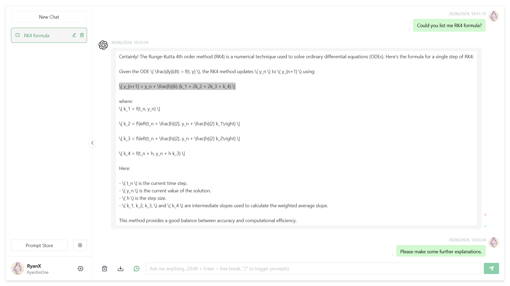

# Another ChatGPT Web

<p align="center">
  
</p>

## Introduction

This project is developed from the source project [chatgpt-web](https://github.com/Chanzhaoyu/chatgpt-web) with backend refactored from [chatgpt-api](https://github.com/transitive-bullshit/agentic/tree/chatgpt-api) which has been out-of-maintenance to official [openai-node](https://github.com/openai/openai-node) API with much flexibility and extensibility.



## New Features

This project has the following new features standing on the source project [chatgpt-web](https://github.com/Chanzhaoyu/chatgpt-web).

### Frontend

[✓] Model selection (gpt-4 / gpt-3.5)

[✓] In-place message editing

[✓] Full session history control

### Backend

[✓] Built with official [openai-node](https://github.com/openai/openai-node) API

[✓] Multi-user authentication and profiles

[✓] Model-wise token usage statistics logging for users

More coming...

## Prerequisites

### PNPM

If you haven't installed `pnpm`
```shell
npm install -g pnpm
```

### Filling in `service/.env` file

You should complete the environment variable file following `service/.env.example`, including setting up your **OpenAI API Key**.

### [optional] Prepare `service/auth.json` file

If you would like to setup access tokens for users, create the auth config file following `service/auth.example.json` to define relevant user information, including name, avatar link, and description.

## Install Dependencies

### Frontend

```shell
pnpm install
```

### Backend

```shell
cd service/

pnpm install
```

## Run in Test Environment

### Frontend Webpage

```shell
pnpm dev
```

### Backend Service

```shell
cd service/

pnpm dev
```

## Packaging and Deployment

### Frontend Webpage

Optionally modify `.env` file.

```shell
# Install
pnpm install

# Pack - this packs all distribution files into the backend folder "service/public/"
pnpm build
```

### Backend Service

After packing the frontend, you can safely move `service/` folder independently to the production environment.

Setup `service/.env` and `service/auth.json` files as described above.

```shell
cd service/

# Install
pnpm install

# Pack
pnpm build

# Start service
pnpm prod
```

## Token Usage Logging

User usage logs would be generated automatically under `service/logs/`, for example:

```
{
  "2024_06_28": {
    "user1": {
      "gpt-3.5-turbo": {
        "prompt_tokens": 768,
        "completion_tokens": 266
      },
      "gpt-4o": {
        "prompt_tokens": 324,
        "completion_tokens": 95
      }
    }
  }
}
```

## FAQ

Q: Does it support unofficial proxy API like in source project?

A: No. It removes proxy support with official API.

Q: Can I migrate my chat history from the source project?

A: Yes. The data store is fully compatible with the source project, and you can safely import your old chat histories.

Q: Does it support other packaging methods like docker container?

A: To maintain simplicity, this project only keeps manual deployment. You could apply other packaging methods from the source repo.

## Contributing

Thanks to everyone who has contributed! Especially [@Gnefil](https://github.com/Gnefil) who learnt a lot during the project development =D.

<a href="https://github.com/RyanXinOne/another-chatgpt-web/graphs/contributors">
  
</a>

## Acknowledgements

Thanks to [@ChenZhaoYu](https://github.com/Chanzhaoyu) for contributing to the source project [chatgpt-web](https://github.com/Chanzhaoyu/chatgpt-web).

## License
[MIT © [ChenZhaoYu, RyanXinOne]](./LICENSE)
